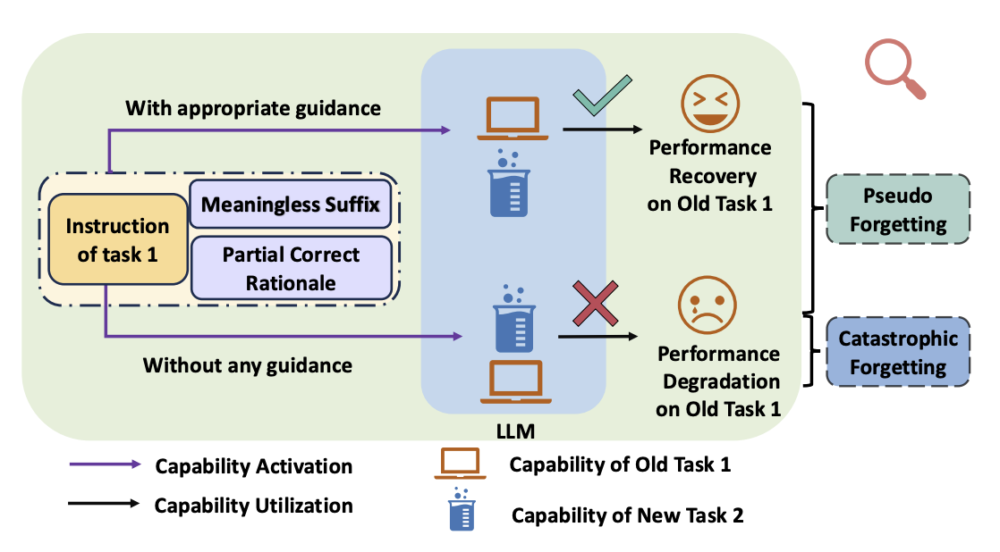
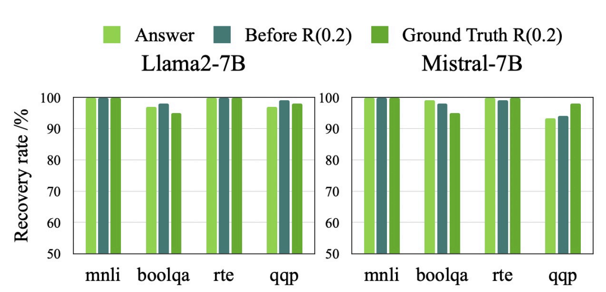
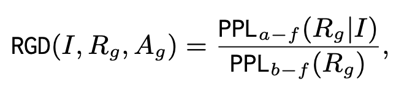

# Investigating Catastrophic Forgetting in Language Models through Rationale-Guidance Difficulty

> "*Memory Is the Scribe of the Soul.*"  
> —Aristotle: Greek Philosopher

<p align="center">        </p>

<p align="center">
  📄 <a href="https://arxiv.org/abs/2411.11932" target="_blank">Paper</a> &nbsp; | &nbsp;
  🤗 <a href="https://huggingface.co/datasets/hot-pot/CL_Benchmark_with_Rationale" target="_blank">Hugging face (data)</a> &nbsp;
</p>

## Contents
- [Investigating Catastrophic Forgetting in Language Models through Rationale-Guidance Difficulty](#investigating-catastrophic-forgetting-in-language-models-through-rationale-guidance-difficulty)
  - [Contents](#contents)
  - [🥳Introduction](#introduction)
  - [🫨Overview](#overview)
    - [Methodology](#methodology)
    - [Results and Hypothesis](#results-and-hypothesis)
  - [🫵Does your LLM truly forget?——Pseudo-Forgetting](#does-your-llm-truly-forgetpseudo-forgetting)
    - [How does a forgetting model perform when **passively** provided with external rationale?](#how-does-a-forgetting-model-perform-when-passively-provided-with-external-rationale)
    - [Can we enable the forgetting model to generate the ''appropriate rationale" **actively**?](#can-we-enable-the-forgetting-model-to-generate-the-appropriate-rationale-actively)
    - [Conclusion](#conclusion)
  - [🚀How to enhance the performance of replay-based CL algorithms?](#how-to-enhance-the-performance-of-replay-based-cl-algorithms)
    - [Rationale-Guidance Difficulty](#rationale-guidance-difficulty)
    - [Replay Data Allocation Method](#replay-data-allocation-method)
    - [Epxerimental Results](#experimetal-results)
  - [🫣Citation](#citation)

## 🥳Introduction
This study first investigates the intrinsic mechanism behind catastrophic forgetting in continual learning (CL), revealing that **task knowledge is not truly lost but hindered by inadequate instruction guidance for appropriate rationales**. We validate this hypothesis **within LLMs** and **with identical knowledge expression** by subjecting the forgetting model to passive external knowledge guidance and incorporating a task-agnostic prefix into the original instruction for an active generation, both of which effectively recover the performance of the forgetting model. 

We then introduce a **Rationale-Guidance Difficulty**, which evaluates the difficulty of guiding the model to generate appropriate rationales—a critical factor in overcoming forgetting. Using this metric, our proposed **replay data allocation method** effectively mitigates forgetting while maintaining model plasticity. 
## 🫨Overview
<p align="center">        </p>

### Methodology
The methodology used in our experiments is shown in the above figure:

1.  We leverage CoT to probe the parameterized knowledge embedded in the model explicitly.
2.  We evaluate the performance of a forgetting model under three situations: 
       - instruction-only prompting
       - instruction-only prompting with externally provided rationale (**passive guidance**)
       - instruction-only prompting with a task-agnostic prefix (**active guidance**)
### Results and Hypothesis
🧐 We find that in the latter two situations, the model could continually actively generate appropriate rationale, recovering task performance.

🤔 We **hypothesize** that the model does not truly forget the old knowledge; instead, the original instructions are insufficient in guiding the generation of appropriate rationale, resulting in "**pseudo-forgetting**."

## 🫵Does your LLM truly forget?——Pseudo-Forgetting
Our assumption is that the model does not truly forget task knowledge; rather, its performance degradation on previous tasks is primarily attributable to the original instructions' inability to guide the generation of relevant knowledge.

- The first question that naturally arises for a forgetting model is: 
  - **Q1**: *How does the model perform when passively provided with appropriate knowledge, such as the rationale of the Chain of Thought (CoT)?*

- If the model does retain prior knowledge, we must address the second question:
  - **Q2**: *Can we help the model to actively generate the appropriate knowledge, such as modifying its prompt?*
  

### How does a forgetting model perform when **passively** provided with external rationale?
<p align="center">        </p>

1. **Experiments Setup**
   - 🧪 for a forgetting model, Concatenate $k$ (eg. $k=0.1$) part of the rationale (ground truth) to the original instruction
   - 🧪 evaluate the model’s performance
2. **Results and Analysis**
   - 🤨**Obervation**:
     - for models of varying sizes, providing even a portion of the appropriate rationale as guid-ance allows the model’s performance to recover
     - as $k$ increases, the model’s performance can recover to pre-forgetting levels
   - 😲**Potential Explanations**:
     1. the instructions fail to guide the generation of the corresponding knowledge
     2. the knowledge has truly been forgotten  

**Note**:
- Prompt example is shown in Figure 3 in our paper.
- The added component with small $k$ does not directly contribute task-specific or answer-relevant information;
  - Rather, it guides the model in shaping the overall direction of its predictions.

---
```
To investigate the underlying mechanism further, we conduct the second experiment.
```
---
### Can we enable the forgetting model to generate the ''appropriate rationale" **actively**?
<p align="center">        </p>

1. **Experiments Setup**
   - 🧪 Add a [Task-Agnostic Prefix](https://arxiv.org/abs/2302.14691) before the original instruction
   - 🧪 Assess the performance of the forgetting model
2. **Results and Analysis**
   - 🤨**Obervation**:
     - Adding a prefix to the original instruction enables the model to generate a suitable rationale and recover performance on forgotten tasks.
     - Different prefixes have varying effects on the recovery of model performance.
       - As we employ a grid search to identify better prefix
   - 😲**Potential Explanations**:
     - We hypothesize that an optimal Task-Agnostic Prefix can restore performance to pre-forgetting levels
     - **The model retains old knowledge, as it can generate the correct rationale and produce the right answer when properly prompted.**


**Note**
- Prompt example is shown in Figure 4 in our paper.
- The reason why we choose [Task-Agnostic Prefix](https://arxiv.org/abs/2302.14691):
  - It ensures that the generated rationale depends on parameterized knowledge rather than context.
  - This approach simply adds prefixes to the original instructions, making the detected knowledge more closely resemble the original 'forgotten knowledge' in QA format.
    - rather than [adopting other formats](https://arxiv.org/abs/2406.12227).

### Conclusion
The results of Q2 rule out the second possible explanation for Q1, indicating that:
  -  **Catastrophic forgetting is primarily due to the inability of instructions to guide the generation of correct rationales and task knowledge is not truly lost**.
## 🚀How to enhance the performance of replay-based CL algorithms?
**Motivation**
- Building on our assumption, we believe that replay-based algorithms offer the simplest and most effective solution to mitigate catastrophic forgetting. 
- Key components of replay-based CL algorithms:
  1. replay data allocation strategies
  2. replay data selection criteria

We propose Rationale-Guidance Difficulty (RGD), which quantifies the difficulty of guiding a model toward an appropriate rationale for a given instruction. Leveraging this metric, we introduce a dynamic replay data allocation mechanism that optimizes the data utilization of previous tasks.
### Rationale-Guidance Difficulty
- The Rationale-Guidance Difficulty score for a given data pair $(x, r, y)$ is calculated as follows:

<p align="center">        </p>

-  For a given previous task $t$, we estimate its RGD score using a set of test data $V$:

    $$\texttt{RGD}_{\theta}^t = \texttt{Mean}(\texttt{RGD}_V)$$

**Note**
- The calculation method of this metric follows the Instruction Following Difficulty (IFD) score proposed by [Li et al.](https://doi.org/10.18653/v1/2024.naacl-long.421), though the IFD score was primarily used for fine-tuning data selection.
### Replay Data Allocation Method
- When training the model on the current task $T_i$, the amount of replay data required for the previous task $T_j$ calculated as follows:


<p align="center">        </p>

- where $\texttt{RGD}^j_{\theta_{i-1}}$ represents the rationale-guidance difficulty of task $j$ after the model has completed training on task $i-1$, and $\alpha$ represents the total amount of replay data.
### Experimental Results
<p align="center">        </p>

**Baselines**
- **Equal Allocation (EA)**: For each previous task, we replay the same amount of samples while learning a new task.
- **[InsCL](https://aclanthology.org/2024.naacl-long.37.pdf)**: Dynamically replays previous data based on task similarity, calculated by Wasserstein Distance with instructions.
  - we use the corresponding LLM as the embedding model.

**Conclusion**
- **Our method effectively alleviates model forgetting and maintains better model plasticity simultaneously across models**.

## 📃License

The code in this repo is licensed by [Apache 2.0](./LICENSE.txt), the data on huggingface and this repo are licensed by [CC BY-NC 4.0](./DATA_LICENSE.txt), the model weights on huggingface are licensed by [GNU AGPL 3.0](./MODEL_LICENSE.txt). To use the models in this project for commercial purposes or public deployment, please sign this [document]() and complete this [questionnaire](https://zg5p4zcqlu.feishu.cn/share/base/form/shrcndUD6XiEhFfwI36QmdmMjzd) to obtain authorization. We only track the commercial use but charge nothing. The service provider shall be responsible for misleading or injurious statements and adverse effects caused by the use of the models contained in this repo and their modified versions.

## 🫣Citation
If you encounter any questions regarding our work, please do not hesitate to submit an issue or contact us directly via email hssun@bit.edu.cn.

If you find our benchmark or evaluation pipeline useful or interesting, please cite our paper.
```
@misc{sun2024revivingdormantmemoriesinvestigating,
      title={Reviving Dormant Memories: Investigating Catastrophic Forgetting in Language Models through Rationale-Guidance Difficulty}, 
      author={Huashan Sun and Yang Gao},
      year={2024},
      eprint={2411.11932},
      archivePrefix={arXiv},
      primaryClass={cs.LG},
      url={https://arxiv.org/abs/2411.11932}, 
}
```
